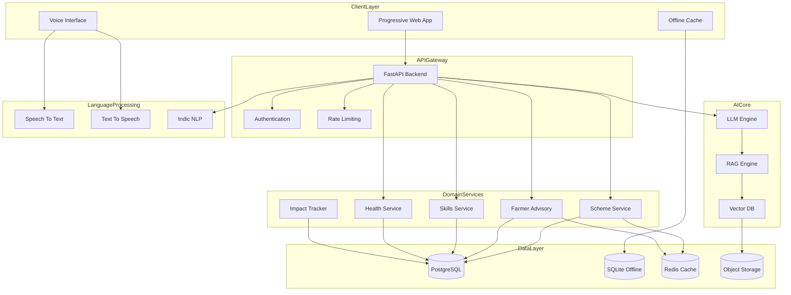

# Design Document: BharatSahayak

## Overview

BharatSahayak is a voice-first, multilingual AI assistant designed to democratize access to government services, agricultural guidance, skill development, and healthcare information for rural and semi-urban India. The system addresses the digital divide by providing an accessible interface for illiterate and semi-literate populations through natural language voice interactions.

The architecture follows a modular, microservices-inspired design with a FastAPI backend, RAG-powered AI engine, multilingual voice processing, and a Progressive Web App frontend. The system is optimized for low-bandwidth environments and supports offline functionality through intelligent caching.

**Key Design Principles:**
- Voice-first interaction for accessibility
- Multilingual support (Hindi + regional languages)
- Offline-first architecture for poor connectivity
- Low-bandwidth optimization
- Privacy and security by design
- Modular, extensible architecture

## Architecture

### High-Level Architecture



### Deployment Architecture

The system supports both cloud and edge deployment:

**Cloud Deployment:**
- Primary backend on AWS/GCP/Azure
- Load balancing for high availability
- Auto-scaling based on demand
- CDN for static assets

**Edge Deployment:**
- Lightweight models for offline operation
- Local SQLite database for caching
- Service workers for PWA offline support
- Periodic sync with cloud when connected

## Components and Interfaces

### 1. Voice Interface Module

**Responsibilities:**
- Convert speech to text (STT)
- Convert text to speech (TTS)
- Detect spoken language
- Handle audio preprocessing and noise reduction

**Key Components:**

**STT Engine:**
```python
class SpeechToTextEngine:
    def __init__(self, model_path: str, supported_languages: List[str]):
        """Initialize STT engine with model and language support"""
        
    def transcribe(self, audio_data: bytes, language: Optional[str] = None) -> TranscriptionResult:
        """
        Convert audio to text
        Returns: TranscriptionResult with text, confidence, detected_language
        """
        
    def detect_language(self, audio_data: bytes) -> str:
        """Detect spoken language from audio"""
        
    def preprocess_audio(self, audio_data: bytes) -> bytes:
        """Reduce noise and normalize audio"""
```

**TTS Engine:**
```python
class TextToSpeechEngine:
    def __init__(self, model_path: str, voice_profiles: Dict[str, str]):
        """Initialize TTS engine with models for different languages"""
        
    def synthesize(self, text: str, language: str, voice_profile: str = "default") -> bytes:
        """
        Convert text to natural-sounding speech
        Returns: Audio data in WAV/MP3 format
        """
        
    def get_supported_languages(self) -> List[str]:
        """Return list of supported languages"""
```

**Interface:**
- POST /api/voice-to-text: Upload audio, receive transcription
- POST /api/text-to-voice: Send text, receive audio
- GET /api/languages: List supported languages

### 2. RAG Engine and LLM Core

**Responsibilities:**
- Process natural language queries
- Retrieve relevant context from knowledge base
- Generate contextual responses
- Maintain conversation history

**Key Components:**

**RAG Engine:**
```python
class RAGEngine:
    def __init__(self, vector_db: VectorDatabase, llm: LanguageModel, embedder: EmbeddingModel):
        """Initialize RAG with vector DB, LLM, and embedding model"""
        
    def query(self, user_query: str, context: ConversationContext, top_k: int = 5) -> RAGResponse:
        """
        Process query using retrieval-augmented generation
        1. Embed query
        2. Retrieve top_k relevant documents from vector DB
        3. Construct prompt with retrieved context
        4. Generate response using LLM
        Returns: RAGResponse with answer, sources, confidence
        """
        
    def add_documents(self, documents: List[Document]) -> None:
        """Add documents to vector database"""
        
    def update_context(self, context: ConversationContext, user_query: str, response: str) -> ConversationContext:
        """Update conversation context with new turn"""
```

**Conversation Manager:**
```python
class ConversationManager:
    def __init__(self, session_store: SessionStore):
        """Initialize with session storage"""
        
    def create_session(self, user_id: str, language: str) -> str:
        """Create new conversation session, return session_id"""
        
    def get_context(self, session_id: str) -> ConversationContext:
        """Retrieve conversation context for session"""
        
    def add_turn(self, session_id: str, user_message: str, assistant_message: str) -> None:
        """Add conversation turn to session history"""
        
    def clear_session(self, session_id: str) -> None:
        """Clear conversation history"""
```

**Interface:**
- POST /api/ask: Submit query, receive AI response
- POST /api/session/create: Create conversation session
- DELETE /api/session/{session_id}: Clear session

### 3. Scheme Service

**Responsibilities:**
- Store and retrieve government scheme information
- Check user eligibility for schemes
- Provide application guidance
- Update scheme database from official sources

**Key Components:**

**Scheme Repository:**
```python
class SchemeRepository:
    def __init__(self, db: Database):
        """Initialize with database connection"""
        
    def search_schemes(self, query: str, filters: SchemeFilters) -> List[Scheme]:
        """Search schemes by keywords and filters"""
        
    def get_scheme_by_id(self, scheme_id: str) -> Scheme:
        """Retrieve scheme details by ID"""
        
    def get_all_schemes(self, category: Optional[str] = None) -> List[Scheme]:
        """Get all schemes, optionally filtered by category"""
        
    def update_scheme(self, scheme: Scheme) -> None:
        """Update scheme information"""
```

**Eligibility Checker:**
```python
class EligibilityChecker:
    def check_eligibility(self, user_profile: UserProfile, scheme: Scheme) -> EligibilityResult:
        """
        Check if user meets scheme eligibility criteria
        Evaluates: age, income, occupation, location, caste, gender, etc.
        Returns: EligibilityResult with is_eligible, missing_criteria, confidence
        """
        
    def get_eligible_schemes(self, user_profile: UserProfile) -> List[Tuple[Scheme, EligibilityResult]]:
        """Get all schemes user is eligible for with eligibility details"""
        
    def explain_eligibility(self, result: EligibilityResult, language: str) -> str:
        """Generate human-readable explanation of eligibility decision"""
```

**Interface:**
- GET /api/schemes: List all schemes with optional filters
- GET /api/schemes/{id}: Get scheme details
- POST /api/schemes/check-eligibility: Check eligibility for specific scheme
- POST /api/schemes/eligible: Get all eligible schemes for user profile

### 4. Farmer Advisory Service

**Responsibilities:**
- Provide crop recommendations
- Offer fertilizer guidance
- Retrieve real-time mandi prices
- Deliver weather-based agricultural advice

**Key Components:**

**Crop Advisor:**
```python
class CropAdvisor:
    def __init__(self, crop_db: CropDatabase, weather_service: WeatherService):
        """Initialize with crop database and weather service"""
        
    def recommend_crops(self, farm_profile: FarmProfile, season: str) -> List[CropRecommendation]:
        """
        Recommend suitable crops based on:
        - Soil type and pH
        - Water availability
        - Season and climate
        - Historical yield data
        - Market demand
        Returns: List of CropRecommendation with crop, suitability_score, reasoning
        """
        
    def get_crop_calendar(self, crop: str, location: str) -> CropCalendar:
        """Get planting, care, and harvest schedule for crop"""
```

**Fertilizer Advisor:**
```python
class FertilizerAdvisor:
    def recommend_fertilizer(self, crop: str, soil_data: SoilData, growth_stage: str) -> FertilizerRecommendation:
        """
        Recommend fertilizer based on:
        - Crop nutrient requirements
        - Soil nutrient levels
        - Growth stage
        Returns: FertilizerRecommendation with type, quantity, timing, application_method
        """
```

**Mandi Price Service:**
```python
class MandiPriceService:
    def __init__(self, price_api: ExternalPriceAPI, cache: Cache):
        """Initialize with external API and cache"""
        
    def get_current_price(self, crop: str, location: str, radius_km: int = 50) -> List[MandiPrice]:
        """
        Get current mandi prices for crop within radius
        Returns: List of MandiPrice with mandi_name, price, date, distance
        """
        
    def get_price_trend(self, crop: str, location: str, days: int = 30) -> PriceTrend:
        """Get historical price trend for crop"""
        
    def update_prices(self) -> None:
        """Fetch latest prices from government APIs"""
```

**Interface:**
- POST /api/farmer/crop-advice: Get crop recommendations
- POST /api/farmer/fertilizer-advice: Get fertilizer guidance
- GET /api/farmer/market-price: Get mandi prices
- GET /api/farmer/crop-calendar: Get crop calendar

### 5. Skills and Employment Service

**Responsibilities:**
- Match users with skill development programs
- Discover government job opportunities
- Provide career guidance
- Track program enrollment

**Key Components:**

**Skills Matcher:**
```python
class SkillsMatcher:
    def __init__(self, skills_db: SkillsDatabase):
        """Initialize with skills program database"""
        
    def match_programs(self, user_profile: UserProfile, preferences: SkillPreferences) -> List[SkillProgram]:
        """
        Match user with relevant skill programs based on:
        - Current education and skills
        - Career interests
        - Location and accessibility
        - Program cost and duration
        Returns: Ranked list of SkillProgram matches
        """
        
    def get_program_details(self, program_id: str) -> SkillProgram:
        """Get detailed information about skill program"""
```

**Job Matcher:**
```python
class JobMatcher:
    def __init__(self, job_db: JobDatabase):
        """Initialize with government job database"""
        
    def search_jobs(self, qualifications: Qualifications, preferences: JobPreferences) -> List[JobPosting]:
        """
        Search government jobs matching qualifications
        Filters by: education, experience, location, department
        Returns: List of JobPosting with details and application deadlines
        """
        
    def get_job_alerts(self, user_profile: UserProfile) -> List[JobPosting]:
        """Get new job postings matching user profile"""
```

**Interface:**
- GET /api/skills: List skill development programs
- POST /api/skills/match: Get personalized program recommendations
- GET /api/jobs: Search government jobs
- POST /api/jobs/alerts: Get job alerts for user

### 6. Health Advisory Service

**Responsibilities:**
- Provide symptom-based health guidance
- Locate nearby health facilities
- Share health scheme information
- Deliver health education content

**Key Components:**

**Health Advisor:**
```python
class HealthAdvisor:
    def __init__(self, symptom_db: SymptomDatabase, facility_db: FacilityDatabase):
        """Initialize with symptom and facility databases"""
        
    def analyze_symptoms(self, symptoms: List[str], user_info: BasicHealthInfo) -> HealthGuidance:
        """
        Provide health guidance based on symptoms
        Returns: HealthGuidance with:
        - Possible conditions (informational only)
        - Urgency level (routine, soon, urgent, emergency)
        - Self-care recommendations
        - When to seek medical care
        - Disclaimer about not replacing professional consultation
        """
        
    def find_facilities(self, location: Location, facility_type: str, radius_km: int = 25) -> List[HealthFacility]:
        """
        Find nearby health facilities
        Types: PHC, CHC, District Hospital, Specialty Center
        Returns: List of HealthFacility with name, type, distance, contact, services
        """
```

**Interface:**
- POST /api/health/check: Submit symptoms, receive guidance
- GET /api/health/facilities: Find nearby health facilities
- GET /api/health/schemes: Get health insurance and benefit schemes

### 7. Language Processing Module

**Responsibilities:**
- Translate between languages
- Handle Indic language processing
- Romanization and script conversion
- Language detection

**Key Components:**

**Language Processor:**
```python
class LanguageProcessor:
    def __init__(self, translation_model: TranslationModel, script_converter: ScriptConverter):
        """Initialize with translation and script conversion models"""
        
    def translate(self, text: str, source_lang: str, target_lang: str) -> str:
        """Translate text between supported languages"""
        
    def detect_language(self, text: str) -> str:
        """Detect language of input text"""
        
    def romanize(self, text: str, source_script: str) -> str:
        """Convert Indic script to Roman script"""
        
    def transliterate(self, text: str, source_script: str, target_script: str) -> str:
        """Convert between Indic scripts"""
```

**Interface:**
- POST /api/translate: Translate text
- POST /api/detect-language: Detect language
- POST /api/transliterate: Convert between scripts

### 8. Impact Tracking Service

**Responsibilities:**
- Record user interactions and outcomes
- Generate analytics and reports
- Track social impact metrics
- Provide dashboards for administrators

**Key Components:**

**Impact Tracker:**
```python
class ImpactTracker:
    def __init__(self, analytics_db: AnalyticsDatabase):
        """Initialize with analytics database"""
        
    def record_interaction(self, event: InteractionEvent) -> None:
        """
        Record user interaction
        Events: query_submitted, scheme_accessed, job_discovered, 
                facility_located, voice_interaction, language_used
        """
        
    def record_outcome(self, outcome: OutcomeEvent) -> None:
        """
        Record successful outcome
        Outcomes: scheme_applied, job_applied, facility_visited, 
                  skill_enrolled, recommendation_followed
        """
        
    def get_metrics(self, filters: MetricFilters) -> ImpactMetrics:
        """
        Get aggregated impact metrics
        Metrics: users_served, queries_resolved, schemes_accessed,
                 farmers_assisted, jobs_discovered, languages_used,
                 rural_adoption_rate, success_rate
        """
        
    def generate_report(self, report_type: str, date_range: DateRange) -> Report:
        """Generate impact report for specified period"""
```

**Interface:**
- POST /api/impact/event: Record interaction or outcome event
- GET /api/impact: Get impact metrics with filters
- GET /api/impact/report: Generate impact report

### 9. Offline Cache Manager

**Responsibilities:**
- Manage local data storage
- Sync with server when connected
- Prioritize content for offline access
- Handle cache invalidation

**Key Components:**

**Cache Manager:**
```python
class CacheManager:
    def __init__(self, local_db: SQLiteDatabase, sync_service: SyncService):
        """Initialize with local database and sync service"""
        
    def cache_content(self, content_type: str, content: Any, priority: int) -> None:
        """
        Cache content for offline access
        Types: schemes, health_tips, crop_advice, frequently_asked
        Priority: 1 (critical) to 5 (nice-to-have)
        """
        
    def get_cached_content(self, content_type: str, query: str) -> Optional[Any]:
        """Retrieve content from local cache"""
        
    def sync_with_server(self) -> SyncResult:
        """
        Synchronize local cache with server
        - Upload pending user data
        - Download updated content
        - Resolve conflicts
        Returns: SyncResult with status and changes
        """
        
    def invalidate_cache(self, content_type: str, max_age_days: int) -> None:
        """Remove stale cached content"""
```

### 10. Authentication and User Management

**Responsibilities:**
- User registration and authentication
- Profile management
- Session management
- Privacy controls

**Key Components:**

**User Manager:**
```python
class UserManager:
    def __init__(self, user_db: UserDatabase, auth_service: AuthService):
        """Initialize with user database and auth service"""
        
    def register_user(self, phone_number: str, language: str) -> User:
        """
        Register new user with phone number (primary identifier)
        Send OTP for verification
        """
        
    def authenticate(self, phone_number: str, otp: str) -> AuthToken:
        """Authenticate user with OTP"""
        
    def get_profile(self, user_id: str) -> UserProfile:
        """Retrieve user profile"""
        
    def update_profile(self, user_id: str, profile_data: Dict) -> UserProfile:
        """Update user profile information"""
        
    def delete_user_data(self, user_id: str) -> None:
        """Delete all user data (GDPR compliance)"""
```

**Interface:**
- POST /api/auth/register: Register new user
- POST /api/auth/verify: Verify OTP and authenticate
- GET /api/user/profile: Get user profile
- PUT /api/user/profile: Update user profile
- DELETE /api/user/data: Delete user data

## Data Models

### Core Data Models

**User Profile:**
```python
@dataclass
class UserProfile:
    user_id: str
    phone_number: str
    language: str
    location: Location
    age: Optional[int]
    gender: Optional[str]
    education_level: Optional[str]
    occupation: Optional[str]
    income_bracket: Optional[str]
    household_size: Optional[int]
    preferences: UserPreferences
    created_at: datetime
    updated_at: datetime
```

**Location:**
```python
@dataclass
class Location:
    state: str
    district: str
    block: Optional[str]
    village: Optional[str]
    pincode: str
    latitude: Optional[float]
    longitude: Optional[float]
```

**Scheme:**
```python
@dataclass
class Scheme:
    scheme_id: str
    name: str
    name_translations: Dict[str, str]  # language -> translated name
    category: str  # agriculture, health, education, employment, social_welfare
    description: str
    description_translations: Dict[str, str]
    benefits: List[str]
    eligibility_criteria: EligibilityCriteria
    required_documents: List[str]
    application_process: List[str]
    application_url: Optional[str]
    department: str
    state: Optional[str]  # None for central schemes
    last_updated: datetime
    source_url: str
```

**Eligibility Criteria:**
```python
@dataclass
class EligibilityCriteria:
    age_min: Optional[int]
    age_max: Optional[int]
    income_max: Optional[int]
    gender: Optional[str]
    occupation: Optional[List[str]]
    education: Optional[List[str]]
    location: Optional[List[str]]  # states/districts where applicable
    caste: Optional[List[str]]
    custom_criteria: Dict[str, Any]  # flexible criteria
```

**Farm Profile:**
```python
@dataclass
class FarmProfile:
    user_id: str
    land_size_acres: float
    soil_type: str
    irrigation_type: str  # rainfed, canal, well, drip
    location: Location
    current_crops: List[str]
    previous_crops: List[str]
    livestock: Optional[List[str]]
```

**Crop Recommendation:**
```python
@dataclass
class CropRecommendation:
    crop_name: str
    suitability_score: float  # 0-1
    expected_yield: str
    water_requirement: str
    duration_days: int
    market_demand: str  # high, medium, low
    estimated_profit: Optional[str]
    reasoning: str
    risks: List[str]
```

**Skill Program:**
```python
@dataclass
class SkillProgram:
    program_id: str
    name: str
    provider: str
    category: str  # technical, vocational, digital, entrepreneurship
    description: str
    duration_weeks: int
    cost: float
    location: Location
    mode: str  # in-person, online, hybrid
    eligibility: EligibilityCriteria
    certification: bool
    placement_support: bool
    registration_url: str
    contact: str
```

**Health Guidance:**
```python
@dataclass
class HealthGuidance:
    urgency_level: str  # routine, soon, urgent, emergency
    possible_conditions: List[str]  # informational only
    self_care_recommendations: List[str]
    when_to_seek_care: str
    red_flags: List[str]  # warning signs requiring immediate care
    disclaimer: str
    confidence: float
```

**Conversation Context:**
```python
@dataclass
class ConversationContext:
    session_id: str
    user_id: str
    language: str
    history: List[ConversationTurn]
    user_profile: Optional[UserProfile]
    current_topic: Optional[str]
    created_at: datetime
    last_activity: datetime
```

**Conversation Turn:**
```python
@dataclass
class ConversationTurn:
    user_message: str
    assistant_message: str
    timestamp: datetime
    intent: Optional[str]
    entities: Dict[str, Any]
```

### Database Schema

**PostgreSQL Tables:**

```sql
-- Users table
CREATE TABLE users (
    user_id UUID PRIMARY KEY,
    phone_number VARCHAR(15) UNIQUE NOT NULL,
    language VARCHAR(10) NOT NULL,
    state VARCHAR(50),
    district VARCHAR(50),
    pincode VARCHAR(10),
    age INTEGER,
    gender VARCHAR(20),
    education_level VARCHAR(50),
    occupation VARCHAR(50),
    income_bracket VARCHAR(50),
    created_at TIMESTAMP DEFAULT NOW(),
    updated_at TIMESTAMP DEFAULT NOW()
);

-- Schemes table
CREATE TABLE schemes (
    scheme_id UUID PRIMARY KEY,
    name VARCHAR(255) NOT NULL,
    category VARCHAR(50) NOT NULL,
    description TEXT,
    benefits JSONB,
    eligibility_criteria JSONB NOT NULL,
    required_documents JSONB,
    application_process JSONB,
    application_url VARCHAR(500),
    department VARCHAR(100),
    state VARCHAR(50),
    last_updated TIMESTAMP,
    source_url VARCHAR(500),
    created_at TIMESTAMP DEFAULT NOW()
);

-- Scheme translations table
CREATE TABLE scheme_translations (
    translation_id UUID PRIMARY KEY,
    scheme_id UUID REFERENCES schemes(scheme_id),
    language VARCHAR(10) NOT NULL,
    name VARCHAR(255),
    description TEXT,
    benefits JSONB,
    UNIQUE(scheme_id, language)
);

-- Interactions table (for impact tracking)
CREATE TABLE interactions (
    interaction_id UUID PRIMARY KEY,
    user_id UUID REFERENCES users(user_id),
    event_type VARCHAR(50) NOT NULL,
    event_data JSONB,
    language VARCHAR(10),
    timestamp TIMESTAMP DEFAULT NOW()
);

-- Outcomes table
CREATE TABLE outcomes (
    outcome_id UUID PRIMARY KEY,
    user_id UUID REFERENCES users(user_id),
    outcome_type VARCHAR(50) NOT NULL,
    outcome_data JSONB,
    timestamp TIMESTAMP DEFAULT NOW()
);

-- Skill programs table
CREATE TABLE skill_programs (
    program_id UUID PRIMARY KEY,
    name VARCHAR(255) NOT NULL,
    provider VARCHAR(100),
    category VARCHAR(50),
    description TEXT,
    duration_weeks INTEGER,
    cost DECIMAL(10,2),
    state VARCHAR(50),
    district VARCHAR(50),
    mode VARCHAR(20),
    eligibility_criteria JSONB,
    certification BOOLEAN,
    placement_support BOOLEAN,
    registration_url VARCHAR(500),
    contact VARCHAR(100),
    created_at TIMESTAMP DEFAULT NOW()
);

-- Job postings table
CREATE TABLE job_postings (
    job_id UUID PRIMARY KEY,
    title VARCHAR(255) NOT NULL,
    department VARCHAR(100),
    description TEXT,
    qualifications JSONB,
    location JSONB,
    application_deadline DATE,
    application_url VARCHAR(500),
    posted_date DATE,
    created_at TIMESTAMP DEFAULT NOW()
);

-- Health facilities table
CREATE TABLE health_facilities (
    facility_id UUID PRIMARY KEY,
    name VARCHAR(255) NOT NULL,
    facility_type VARCHAR(50),
    state VARCHAR(50),
    district VARCHAR(50),
    address TEXT,
    latitude DECIMAL(10,8),
    longitude DECIMAL(11,8),
    contact VARCHAR(100),
    services JSONB,
    created_at TIMESTAMP DEFAULT NOW()
);

-- Mandi prices table
CREATE TABLE mandi_prices (
    price_id UUID PRIMARY KEY,
    crop_name VARCHAR(100) NOT NULL,
    mandi_name VARCHAR(100),
    state VARCHAR(50),
    district VARCHAR(50),
    price_per_quintal DECIMAL(10,2),
    price_date DATE NOT NULL,
    created_at TIMESTAMP DEFAULT NOW()
);

-- Conversation sessions table
CREATE TABLE conversation_sessions (
    session_id UUID PRIMARY KEY,
    user_id UUID REFERENCES users(user_id),
    language VARCHAR(10),
    history JSONB,
    current_topic VARCHAR(100),
    created_at TIMESTAMP DEFAULT NOW(),
    last_activity TIMESTAMP DEFAULT NOW()
);
```

**SQLite Schema (Offline Cache):**

```sql
-- Cached schemes
CREATE TABLE cached_schemes (
    scheme_id TEXT PRIMARY KEY,
    data TEXT NOT NULL,  -- JSON serialized scheme
    language TEXT,
    priority INTEGER,
    cached_at INTEGER,  -- Unix timestamp
    expires_at INTEGER
);

-- Cached content
CREATE TABLE cached_content (
    content_id TEXT PRIMARY KEY,
    content_type TEXT NOT NULL,
    data TEXT NOT NULL,
    language TEXT,
    priority INTEGER,
    cached_at INTEGER,
    expires_at INTEGER
);

-- Pending sync
CREATE TABLE pending_sync (
    sync_id TEXT PRIMARY KEY,
    operation TEXT NOT NULL,  -- create, update, delete
    entity_type TEXT NOT NULL,
    entity_data TEXT NOT NULL,
    created_at INTEGER
);

-- User preferences (offline)
CREATE TABLE user_preferences (
    user_id TEXT PRIMARY KEY,
    profile_data TEXT NOT NULL,
    updated_at INTEGER
);
```


## Correctness Properties

*A property is a characteristic or behavior that should hold true across all valid executions of a system—essentially, a formal statement about what the system should do. Properties serve as the bridge between human-readable specifications and machine-verifiable correctness guarantees.*

### Property Reflection

After analyzing all acceptance criteria, I identified the following redundancies and consolidations:

**Redundancies Eliminated:**
- Properties 2.1 and 5.4 both test scheme search - consolidated into Property 1
- Properties 2.2 and 4.2 both test completeness of displayed information - generalized into Property 2
- Properties 1.2 and 1.3 can be combined into a single voice processing property
- Properties 7.2 and 7.3 both relate to offline caching - combined into Property 15
- Properties 9.1 and 9.3 both test event recording - consolidated into Property 20

**Properties Combined:**
- Eligibility checking (2.3) and personalized recommendations (8.2) share similar logic - kept separate as they serve different domains
- Profile storage (8.1) is a round-trip property that validates data persistence
- Multiple properties test "completeness of information" - generalized into a single property that applies across domains

### Core Properties

**Property 1: Voice-to-Text Transcription Accuracy**
*For any* audio input in a supported language, when transcribed by the Voice_Interface, the resulting text should accurately represent the spoken content with at least 85% word accuracy.
**Validates: Requirements 1.1**

**Property 2: Text-to-Speech Audio Generation**
*For any* text input and supported language, the Voice_Interface should generate valid audio output that can be played without errors.
**Validates: Requirements 1.2**

**Property 3: Language Detection Accuracy**
*For any* audio input in a supported Indian language, the System should correctly identify the language with at least 90% accuracy.
**Validates: Requirements 1.3**

**Property 4: Scheme Search Relevance**
*For any* user query about government schemes, the System should retrieve schemes from the Scheme_Database where the scheme description, category, or benefits semantically match the query context.
**Validates: Requirements 2.1, 5.4**

**Property 5: Complete Information Display**
*For any* scheme, skill program, or job posting displayed to the user, the output should contain all required fields (name, description, eligibility, application process, contact information) with no null or missing critical fields.
**Validates: Requirements 2.2, 4.2**

**Property 6: Eligibility Determination Correctness**
*For any* user profile and scheme, the Eligibility_Checker should return "eligible" if and only if the user profile satisfies all criteria in the scheme's eligibility_criteria, and "not eligible" otherwise.
**Validates: Requirements 2.3**

**Property 7: Crop Recommendation Generation**
*For any* valid farm profile, the System should generate at least one crop recommendation with all required fields (crop_name, suitability_score, reasoning, water_requirement, duration_days) populated.
**Validates: Requirements 3.1**

**Property 8: Fertilizer Guidance Completeness**
*For any* crop and soil data combination, the System should provide fertilizer guidance containing fertilizer type, quantity, timing, and application method.
**Validates: Requirements 3.2**

**Property 9: Mandi Price Radius Constraint**
*For any* location and crop query, all returned mandi prices should be from mandis within the specified radius (default 50km), and results should be sorted by distance.
**Validates: Requirements 3.3**

**Property 10: Skill Program Matching Relevance**
*For any* user profile with specified skills and interests, returned skill programs should match at least one of the user's interests or build upon their current skills.
**Validates: Requirements 4.1**

**Property 11: Job Search Qualification Matching**
*For any* job search with specified qualifications, all returned job postings should have qualification requirements that the user meets or are within one level of the user's education.
**Validates: Requirements 4.3**

**Property 12: Health Guidance Generation**
*For any* list of symptoms, the Health_Advisor should generate guidance containing urgency_level, possible_conditions, self_care_recommendations, when_to_seek_care, and disclaimer fields.
**Validates: Requirements 5.1**

**Property 13: Health Facility Distance Accuracy**
*For any* location query, all returned health facilities should be within the specified radius, sorted by distance in ascending order, with accurate distance calculations.
**Validates: Requirements 5.2**

**Property 14: Health Disclaimer Presence**
*For any* health guidance output, the response should contain a disclaimer stating that the advice is informational and not a substitute for professional medical consultation.
**Validates: Requirements 5.3**

**Property 15: Conversation Context Preservation**
*For any* conversation session, when a follow-up query references entities or topics from previous turns, the RAG_Engine should have access to the conversation history and maintain context across turns.
**Validates: Requirements 6.1**

**Property 16: Semantic Search Relevance**
*For any* user query, the top-k documents retrieved from the knowledge base should have semantic similarity scores above a threshold (e.g., 0.7) to the query embedding.
**Validates: Requirements 6.2**

**Property 17: Official Source Prioritization**
*For any* query where both official government sources and general sources are available, the RAG_Engine should rank official sources higher in the retrieved documents.
**Validates: Requirements 6.5**

**Property 18: Bandwidth Constraint Compliance**
*For any* API response, the total payload size should be under 100KB when compressed, ensuring low-bandwidth compatibility.
**Validates: Requirements 7.2**

**Property 19: Offline Cache Priority**
*For any* content cached for offline access, high-priority content (priority 1-2) should be cached before low-priority content (priority 3-5), and the cache should respect size limits.
**Validates: Requirements 7.3**

**Property 20: Profile Data Round-Trip**
*For any* user profile data, storing the profile and then retrieving it should return an equivalent profile with all fields preserved.
**Validates: Requirements 8.1**

**Property 21: Personalized Recommendation Filtering**
*For any* two user profiles with different locations, occupations, or education levels, the recommended schemes, jobs, or programs should differ to reflect the profile differences.
**Validates: Requirements 8.2**

**Property 22: Recommendation Explanation Presence**
*For any* personalized recommendation, the output should include an explanation field describing why the item was recommended based on user profile attributes.
**Validates: Requirements 8.4**

**Property 23: Interaction Event Recording**
*For any* user interaction (query, scheme access, job discovery), the Impact_Tracker should record an event with required fields: user_id, event_type, timestamp, and event_data.
**Validates: Requirements 9.1, 9.3**

**Property 24: Impact Metrics Aggregation**
*For any* set of recorded interactions, aggregating by region, language, or service category should produce counts that sum to the total number of interactions.
**Validates: Requirements 9.2**

**Property 25: Analytics Data Anonymization**
*For any* analytics query result, the returned data should not contain personally identifiable information (phone numbers, exact locations, names).
**Validates: Requirements 9.4**

**Property 26: Scheme Data Freshness Tracking**
*For any* scheme in the database, the scheme record should include a last_updated timestamp indicating when the data was last verified.
**Validates: Requirements 12.1**

**Property 27: Unverified Information Indicators**
*For any* information that cannot be verified against official sources, the response should include an uncertainty indicator or source attribution.
**Validates: Requirements 12.3**

**Property 28: Time-Sensitive Data Timestamps**
*For any* time-sensitive information (market prices, weather, job deadlines), the response should include a timestamp indicating when the data was last updated.
**Validates: Requirements 12.5**

### Edge Case Properties

**Property 29: Emergency Symptom Detection**
*For any* symptom list containing known emergency indicators (chest pain, difficulty breathing, severe bleeding), the Health_Advisor should set urgency_level to "emergency" and recommend immediate medical care.
**Validates: Requirements 5.5**

**Property 30: Missing Market Price Handling**
*For any* crop and location where market price data is unavailable, the System should return an error message indicating unavailability and provide the most recent available data with its timestamp.
**Validates: Requirements 3.5**

**Property 31: Out-of-Scope Query Handling**
*For any* query that is outside the system's domain (e.g., asking about movie recommendations), the System should respond with a message indicating limitations and suggest relevant resources.
**Validates: Requirements 6.4**

## Error Handling

### Error Categories

**1. Voice Processing Errors:**
- Audio quality too poor for transcription
- Unsupported language detected
- Audio format not supported
- TTS synthesis failure

**Error Response:**
```python
{
    "error": "VOICE_PROCESSING_ERROR",
    "message": "Unable to process audio. Please try speaking clearly in a supported language.",
    "message_translations": {"hi": "ऑडियो प्रोसेस नहीं हो सका। कृपया समर्थित भाषा में स्पष्ट रूप से बोलें।"},
    "supported_languages": ["hi", "en", "bn", "te", "mr"],
    "retry_allowed": true
}
```

**2. Data Unavailability Errors:**
- Scheme information not found
- Market prices unavailable
- Health facilities not found in area
- Job postings expired

**Error Response:**
```python
{
    "error": "DATA_NOT_FOUND",
    "message": "No market prices available for this crop and location.",
    "alternative_data": {
        "last_available_date": "2024-01-15",
        "last_available_price": 2500,
        "nearby_mandis": ["Mandi A - 60km", "Mandi B - 75km"]
    },
    "suggestions": ["Try nearby districts", "Check again tomorrow"]
}
```

**3. Eligibility Check Errors:**
- Insufficient user profile information
- Invalid criteria values
- Scheme eligibility rules incomplete

**Error Response:**
```python
{
    "error": "INSUFFICIENT_PROFILE_DATA",
    "message": "Cannot determine eligibility. Please provide: age, income, location.",
    "missing_fields": ["age", "income", "location"],
    "can_proceed_without": false
}
```

**4. Authentication Errors:**
- Invalid OTP
- Expired session
- Unauthorized access

**Error Response:**
```python
{
    "error": "AUTHENTICATION_FAILED",
    "message": "Invalid OTP. Please try again.",
    "retry_allowed": true,
    "remaining_attempts": 2
}
```

**5. Rate Limiting Errors:**
- Too many requests
- Quota exceeded

**Error Response:**
```python
{
    "error": "RATE_LIMIT_EXCEEDED",
    "message": "Too many requests. Please try again in 60 seconds.",
    "retry_after_seconds": 60,
    "quota_reset_time": "2024-01-20T10:30:00Z"
}
```

**6. Offline Mode Errors:**
- Feature requires internet
- Cache expired
- Sync failed

**Error Response:**
```python
{
    "error": "OFFLINE_FEATURE_UNAVAILABLE",
    "message": "This feature requires internet connection. Please connect and try again.",
    "offline_alternatives": ["View cached schemes", "Access saved content"],
    "last_sync_time": "2024-01-19T08:00:00Z"
}
```

### Error Handling Strategy

**Graceful Degradation:**
- When real-time data is unavailable, provide cached data with timestamps
- When voice processing fails, fall back to text input
- When personalization fails, provide general recommendations
- When translation fails, provide English with apology message

**User-Friendly Messages:**
- All error messages available in user's preferred language
- Simple language appropriate for low-literacy users
- Actionable suggestions for resolution
- Clear indication of whether retry will help

**Logging and Monitoring:**
- All errors logged with context (user_id, query, timestamp)
- Critical errors trigger alerts
- Error rates monitored per service
- User-facing errors tracked for UX improvement

**Retry Logic:**
- Automatic retry for transient failures (network, timeout)
- Exponential backoff for API calls
- Maximum 3 retry attempts
- User notified after final failure

## Testing Strategy

### Dual Testing Approach

The system requires both unit testing and property-based testing for comprehensive coverage:

**Unit Tests:**
- Specific examples demonstrating correct behavior
- Edge cases (empty inputs, boundary values, special characters)
- Error conditions (invalid data, missing fields, network failures)
- Integration points between components
- Mock external dependencies (APIs, databases)

**Property-Based Tests:**
- Universal properties that hold for all inputs
- Randomized input generation for comprehensive coverage
- Minimum 100 iterations per property test
- Each test tagged with feature name and property number

### Property-Based Testing Configuration

**Framework:** Use `hypothesis` for Python (or `fast-check` for TypeScript if frontend testing)

**Test Configuration:**
```python
from hypothesis import given, settings, strategies as st

@settings(max_examples=100, deadline=None)
@given(
    user_profile=st.builds(UserProfile, ...),
    scheme=st.builds(Scheme, ...)
)
def test_eligibility_determination_correctness(user_profile, scheme):
    """
    Feature: bharatsahayak, Property 6: Eligibility Determination Correctness
    For any user profile and scheme, the Eligibility_Checker should return 
    "eligible" if and only if the user profile satisfies all criteria.
    """
    result = eligibility_checker.check_eligibility(user_profile, scheme)
    
    # Manually verify eligibility based on criteria
    expected_eligible = verify_eligibility_manually(user_profile, scheme)
    
    assert result.is_eligible == expected_eligible
```

**Test Tagging Convention:**
```python
# Tag format: Feature: {feature_name}, Property {number}: {property_title}
"""
Feature: bharatsahayak, Property 1: Voice-to-Text Transcription Accuracy
"""
```

### Testing Coverage by Component

**Voice Interface Module:**
- Unit tests: Specific audio samples, format validation, error handling
- Property tests: Property 1 (STT accuracy), Property 2 (TTS generation), Property 3 (language detection)

**RAG Engine:**
- Unit tests: Specific queries, context handling, prompt construction
- Property tests: Property 15 (context preservation), Property 16 (semantic relevance), Property 17 (source prioritization)

**Scheme Service:**
- Unit tests: Specific schemes, edge cases (missing fields), error conditions
- Property tests: Property 4 (search relevance), Property 5 (completeness), Property 6 (eligibility correctness)

**Farmer Advisory:**
- Unit tests: Specific crops and soil types, price lookup edge cases
- Property tests: Property 7 (crop recommendations), Property 8 (fertilizer guidance), Property 9 (price radius)

**Skills Service:**
- Unit tests: Specific programs and jobs, matching edge cases
- Property tests: Property 10 (program matching), Property 11 (job qualification matching)

**Health Service:**
- Unit tests: Specific symptoms, emergency cases, facility lookup
- Property tests: Property 12 (guidance generation), Property 13 (distance accuracy), Property 14 (disclaimer presence), Property 29 (emergency detection)

**Impact Tracker:**
- Unit tests: Specific events, aggregation edge cases
- Property tests: Property 23 (event recording), Property 24 (aggregation), Property 25 (anonymization)

**Offline Cache:**
- Unit tests: Sync scenarios, cache eviction, storage limits
- Property tests: Property 18 (bandwidth), Property 19 (cache priority)

**User Management:**
- Unit tests: Registration flow, authentication, data deletion
- Property tests: Property 20 (profile round-trip)

### Integration Testing

**End-to-End Flows:**
1. Voice query → STT → RAG → Response → TTS
2. User registration → Profile creation → Personalized recommendations
3. Offline mode → Cache access → Sync on reconnection
4. Scheme search → Eligibility check → Application guidance

**External Integration Tests:**
- Government API mocking for scheme data
- Mandi price API mocking
- Weather service integration
- SMS/OTP service integration

### Performance Testing

**Load Testing:**
- Concurrent users: 1000+ simultaneous queries
- Response time: < 3 seconds for 95th percentile
- Voice processing: < 5 seconds end-to-end

**Stress Testing:**
- Database connection pool limits
- Vector DB query performance with 1M+ documents
- Cache size limits and eviction

**Low-Resource Testing:**
- Test on devices with 1GB RAM
- Test with 2G network speeds
- Test with intermittent connectivity

### Security Testing

**Penetration Testing:**
- SQL injection attempts
- XSS attacks on user inputs
- Authentication bypass attempts
- Rate limiting effectiveness

**Privacy Testing:**
- Verify PII encryption at rest
- Verify TLS for data in transit
- Test data deletion completeness
- Verify anonymization in analytics

### Accessibility Testing

**Voice Interface Testing:**
- Test with various accents and dialects
- Test with background noise
- Test with low-quality microphones
- Test language switching

**Low-Literacy Testing:**
- Verify simple language in responses
- Test voice-only interaction flows
- Verify visual simplicity of PWA


